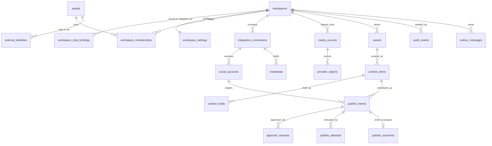

# Recommended Target Data Model

**Status:** Recommended (this session's design; downstream of
[02-self-evaluation.md](02-self-evaluation.md), which readers should accept or contest
first).
**Baseline:** `main` at `683f7cf`.

This document specifies the end state. How the running system reaches it is
[06-migration-and-consumer-plan.md](06-migration-and-consumer-plan.md); what ships in
which order is [04-epic.md](04-epic.md).

---

## 1. Design goals

Derived from the liabilities in the self-evaluation (§4.2) and bounded by the
non-goals in §6:

1. Tenant ownership is **non-nullable and structural**: every tenant-scoped row
   carries `workspace_id NOT NULL` with referential integrity; no query-time filter
   is optional.
2. External side effects (Telegram sends, Instagram publishes) are **durable
   attempts** driven through a transactional outbox, so a crash never leaves an
   unrecorded side effect and a retry never repeats a completed one.
3. Every concept has **one source of truth**; denormalized copies are read models,
   rebuilt from the ledger, never hand-maintained counters.
4. The database schema has **one production mechanism** (Alembic), exercised by CI
   and applied at deploy.
5. The model supports the near roadmap without new conflation: multi-account
   posting, Instagram insights (#666), per-tenant billing (#661–#665), and a
   web-first dashboard.

## 2. Target entities

Names below are proposals; the boundaries are the point. Types shown are
illustrative PostgreSQL, not final DDL.

### 2.1 Tenancy and identity

| Entity | Replaces / absorbs | Key fields | Notes |
|---|---|---|---|
| `workspaces` | tenant identity currently implicit in `chat_settings` | `id uuid PK`, `name`, `status` (`active\|suspended\|deleted`), `created_at` | The tenant root. Owns everything below. Exists before, and independently of, any Telegram chat. |
| `workspace_chat_bindings` | `chat_settings.telegram_chat_id` | `workspace_id NOT NULL FK`, `telegram_chat_id bigint UNIQUE`, `bound_at`, `unbound_at` | A Telegram chat is an **external binding** of a workspace, not the workspace. One live binding per chat (partial unique on `unbound_at IS NULL`). v1 keeps one live binding per workspace too — see non-goal N6. |
| `people` | `users` (retained and extended) | as today | The person spine stays. `users.role` (global admin flag) survives; per-workspace authority moves entirely to memberships. `total_posts` counter is dropped in favor of the outcome ledger. |
| `external_identities` | Telegram fields on `users` | `person_id NOT NULL FK`, `provider` (`telegram`), `provider_user_id`, `display fields`, unique `(provider, provider_user_id)` | Makes room for a second login provider without another `users` rewrite; Telegram remains the only provider in v1. |
| `workspace_memberships` | `user_chat_memberships` | `workspace_id NOT NULL`, `person_id NOT NULL`, `role` (`owner\|admin\|member`), `is_active`, unique `(workspace_id, person_id)` | Same shape as today's table, re-rooted on workspace. |
| `workspace_settings` | the ~20 config columns on `chat_settings` | `workspace_id PK/FK`, typed columns for schedule, caption, TTLs, toggles | Config separated from identity. Every value **materialized non-null at creation** from defaults — the `NULL means env fallback` duality ends (#532). Env vars remain only as new-workspace defaults (`src/config/defaults.py` pattern). |

Onboarding state (`onboarding_sessions`, `chat_settings.onboarding_step`) collapses
into one `workspace_onboarding` state machine keyed by workspace, with the DM wizard
holding a `workspace_id` from step one (workspaces can exist unbound).

### 2.2 Integrations, social accounts, credentials

| Entity | Replaces / absorbs | Key fields | Notes |
|---|---|---|---|
| `integration_connections` | implicit provider state on `api_tokens`/`chat_settings` | `workspace_id NOT NULL`, `provider` (`meta\|google_drive`), `status`, `connected_by_person_id`, `connected_at`, `revoked_at` | The unit a user connects/disconnects and the anchor for provider-level health/alert state (e.g. today's `gdrive_alerted_at`). |
| `social_accounts` | `instagram_accounts` | `workspace_id NOT NULL`, `connection_id FK`, `platform` (`instagram`), `platform_account_id`, `username`, `is_active`; unique `(workspace_id, platform, platform_account_id)` | **Workspace-owned.** The same Instagram profile connected by two workspaces is two rows — matching how Meta scopes tokens per authorizing user/app, and fixing the global-uniqueness problem (self-evaluation L4). The active-account selection becomes `workspace_settings.active_social_account_id`. |
| `credentials` | `api_tokens` | `workspace_id NOT NULL`, `connection_id FK`, `social_account_id nullable FK`, `kind` (`access_token\|refresh_token\|service_account`), `auth_method NOT NULL`, `ciphertext`, `expires_at`, `revoked_at`, `scopes`; unique `(connection_id, social_account_id, kind, auth_method)` with no nullable columns in the key | Preserves the Fernet/MultiFernet encryption and rotation machinery unchanged (`src/utils/encryption.py`). `auth_method NOT NULL` closes #596; keying on the connection closes #595's clobber class; workspace ownership closes #627's fallback class structurally. |

### 2.3 Media

Today's `media_items` splits along its four lifecycles (self-evaluation L5):

| Entity | Lifecycle | Key fields |
|---|---|---|
| `media_sources` | connect/disconnect, sync scheduling | `workspace_id NOT NULL`, `kind` (`local\|google_drive`), `root_identifier`, `sync_enabled`, `last_synced_at` |
| `provider_objects` | mirrors the external file; churns on rename/move/delete | `source_id FK`, `provider_ref` (path/file id), `content_hash`, `observed_missing_at`; unique `(source_id, provider_ref)` |
| `assets` | durable content identity; survives renames and re-uploads | `workspace_id NOT NULL`, `content_hash`, `mime_type`, `byte_size`; unique `(workspace_id, content_hash)` — dedup becomes a constraint, not a CLI sweep |
| `content_items` | editorial: what the team curates and posts | `workspace_id NOT NULL`, `asset_id FK`, `category`, `caption`, `generated_caption`, `title`, `link_url`, `tags`, `is_active` |
| `content_holds` | replaces `media_posting_locks` | `workspace_id NOT NULL`, `content_item_id FK`, `reason`, `held_until nullable`; partial unique for permanent holds mirrored in ORM (#641, #603) |

Cloudinary egress state (upload URL, expiry) moves onto the **publish attempt** that
needed it (§2.4) — it was never a property of the media itself. Backfill provenance
(`instagram_media_id`, `backfilled_at`) becomes an attribute of imported outcomes in
the ledger, not of media rows.

### 2.4 Publishing

The pipeline separates decision, delivery, attempt, outcome, and audit — extending,
not replacing, the shipped delivery-state machine (`src/models/enums.py`, migrations
`043`–`049`):

| Entity | Replaces / absorbs | Key fields | Notes |
|---|---|---|---|
| `publish_intents` | `posting_queue` (the durable part) | `workspace_id NOT NULL`, `content_item_id FK`, `social_account_id FK`, `scheduled_for`, `status` (`scheduled\|awaiting_approval\|approved\|publishing\|completed\|cancelled\|expired`), `created_by` | **Not deleted on completion.** The intent row is the idempotency anchor: partial unique one *live* intent per `(workspace_id, content_item_id)` (#604). |
| `approval_requests` | `telegram_message_id`/delivery states on the queue row | `intent_id FK`, `channel` (`telegram`), `chat_binding_id FK`, `message_ref`, `status` (`pending\|sent_unconfirmed\|delivered\|responded\|expired`), `responded_by_person_id` | Today's `sent_unconfirmed`/`delivered`/INV-1 semantics carry over verbatim as CHECKs. |
| `publish_attempts` | `publishing` status + `instagram_container_id` + Cloudinary temp state | `intent_id FK`, `attempt_no`, `method` (`instagram_api\|telegram_manual\|system`), `status` (`started\|container_created\|published\|failed`), `container_ref`, `egress_url`, `error`; unique `(intent_id, attempt_no)` | Claim-before-publish becomes a **row per attempt**, with a DB-guarded claim (`UPDATE … WHERE status = …` transition CHECKs) closing #711 structurally. |
| `publish_outcomes` | `posting_history` (evolved in place) | adds `intent_id` with a **unique index** — one terminal outcome per intent (#695, #551); keeps append-only semantics, method/status vocabularies, and platform IDs | `posting_history` is the one legacy table that becomes a target table rather than being replaced: it is already append-only and already the analytic source. |
| `audit_events` | `audit_log` (widened) | `workspace_id NOT NULL`, `actor_person_id`, `entity_type`, `entity_id`, `action`, `payload jsonb` | One audit spine for settings, membership, holds, intents, and credential events. `user_interactions` and `service_runs` remain operational telemetry (see N8). |
| `outbox_messages` | new | `id`, `workspace_id`, `topic`, `payload jsonb`, `available_at`, `claimed_at`, `completed_at`, `attempts` | Written in the **same transaction** as the state change that requires a side effect; a dispatcher loop (worker) performs the send/publish and records the attempt. Replaces process-local operation locks and in-flight markers (#578, #611, #612). |

Category mix keeps its Type-2 SCD shape, re-rooted with `workspace_id NOT NULL` and a
partial unique guaranteeing a single current row per `(workspace_id, category)`
(#643).

### 2.5 Relationship sketch

## 3. Invariants PostgreSQL enforces

1. **Tenant ownership:** `workspace_id NOT NULL` + FK on every workspace-scoped
   table. No nullable-tenant escape hatch survives contract.
2. **Defense-in-depth isolation:** child tables that reference both a workspace and a
   workspace-owned parent carry a **composite FK**
   (`(workspace_id, parent_id) REFERENCES parent(workspace_id, id)`), so a row can
   never point across tenants even if application code passes the wrong id.
   Row-Level Security is a post-contract option, not a v1 dependency (see N7).
3. **Idempotency:**
   - one live `publish_intent` per `(workspace_id, content_item_id)` (partial unique);
   - one `publish_outcome` per intent (unique);
   - one attempt number per intent (unique);
   - one live chat binding per `telegram_chat_id` (partial unique);
   - asset dedup by `(workspace_id, content_hash)` (unique);
   - credential identity with **no nullable key columns**.
4. **State machines where practical:** status columns keep the enum-SSOT + derived
   CHECK + CI parity-gate pattern already proven in `src/models/enums.py`;
   stamp-dependency CHECKs generalize INV-1 (e.g. `delivered ⇒ message_ref`,
   `container_created ⇒ container_ref`, `completed ⇒ outcome exists` enforced by
   deferred trigger or application-level transition guard where a CHECK cannot reach).
   Transition legality is guarded by compare-and-set `UPDATE … WHERE status IN (…)`
   with the Unit of Work asserting row count — the DB rejects illegal jumps by
   construction of the write, not by trusting callers.
5. **Referential lifecycle:** every FK declares its `ON DELETE` behavior explicitly
   (#417): `RESTRICT` by default; `CASCADE` only inside a single aggregate
   (e.g. provider_objects under a source); person references in ledgers use
   `SET NULL` + snapshot columns.
6. **Constraint parity:** every constraint exists in exactly one authoritative place
   (Alembic migration) and is asserted equal to ORM metadata by a CI diff test
   (#639, #641, #654) — partial indexes included.

## 4. Application-architecture commitments

These are part of the model because the current failure modes are joint
code-and-schema problems:

1. **Unit of Work owns transactions.** Services open a UoW; repositories receive its
   session and **never commit** (#608, #630). `atomic_session`'s monkey-patching is
   retired. One logical operation = one transaction = one commit.
2. **Outbox dispatcher replaces in-process coordination.** Claiming an outbox message
   is a DB-guarded compare-and-set; workers are therefore restart-safe and, later,
   horizontally scalable (#578).
3. **Reconciliation is a product feature, not a patchwork.** One reconciler owns:
   aged `sent_unconfirmed` approvals, wedged `publishing` attempts (#565), orphaned
   intents, and outcome/attempt mismatches — each emitting metrics, replacing the
   four ad-hoc cleanup loops (#571).
4. **Read models are rebuildable.** `times_posted`, `total_posts`,
   `last_post_sent_at` become derived views or maintained-by-ledger projections with
   a rebuild command; drift is detectable by re-derivation.
5. **One migration system.** Alembic produces production upgrades, fresh installs,
   and test schemas; `create_all()` and `setup_database.sql` are retired (#638,
   #411, #712).

## 5. Mapping from current tables

| Current | Target disposition |
|---|---|
| `chat_settings` | Split → `workspaces` + `workspace_chat_bindings` + `workspace_settings` + onboarding state; retired after contract |
| `users` | Retained as `people` (Telegram columns migrate to `external_identities`) |
| `user_chat_memberships` | Re-rooted → `workspace_memberships` |
| `instagram_accounts` | Re-owned → `social_accounts` (workspace-scoped) |
| `api_tokens` | → `credentials` under `integration_connections` |
| `media_items` | Split → `provider_objects` + `assets` + `content_items` (+ attempt-held egress state) |
| `media_posting_locks` | → `content_holds` |
| `posting_queue` | → `publish_intents` + `approval_requests` + `publish_attempts` (queue rows stop being deleted-on-terminal) |
| `posting_history` | **Evolved in place** → `publish_outcomes` (gains `intent_id` + unique) |
| `category_post_case_mix` | Re-rooted, single-current constraint added |
| `onboarding_sessions` | Merged into workspace onboarding state |
| `audit_log` | Widened → `audit_events` |
| `user_interactions`, `service_runs` | Unchanged (operational telemetry; gain non-null workspace attribution where derivable) |
| `schema_version` | Replaced by `alembic_version` (values preserved in an archive table) |
| `waitlist_signups` | Unchanged (landing-owned; see N9) |

## 6. Deliberate non-goals

- **N1 — Not a general-purpose social network platform.** No generic "posts",
  "feeds", "followers", or cross-network abstraction layers. `platform` enums exist
  so Instagram is not hard-coded into column names, but only Instagram ships.
- **N2 — No event sourcing.** Attempts/outcomes/audit are append-only ledgers, but
  current-state tables remain the source of truth for current state.
- **N3 — No service decomposition.** Same worker + API + landing topology; this is a
  data-model migration, not a microservices program.
- **N4 — No billing schema in this package.** The workspace root is deliberately
  billing-ready, but tiers/entitlements/Stripe belong to #661–#665.
- **N5 — Telegram remains the approval UX.** No approval-channel abstraction beyond
  the `approval_requests.channel` column.
- **N6 — No many-chats-per-workspace product feature.** The binding table permits it
  structurally; v1 keeps 1:1 and the UI/bot assume it.
- **N7 — No RLS dependency in v1.** Composite FKs + non-null ownership are the
  enforced isolation; RLS is evaluated after contract.
- **N8 — No observability-store redesign.** `user_interactions`/`service_runs`
  retention/consolidation stays with #415, #423.
- **N9 — No landing-site data-ownership change.** The waitlist stays Drizzle-owned;
  the only landing change is the session/type mapping in
  [06-migration-and-consumer-plan.md](06-migration-and-consumer-plan.md) §C7.
- **N10 — No scheduling-engine redesign.** JIT scheduling logic is preserved; only
  its cursor/config storage moves.
