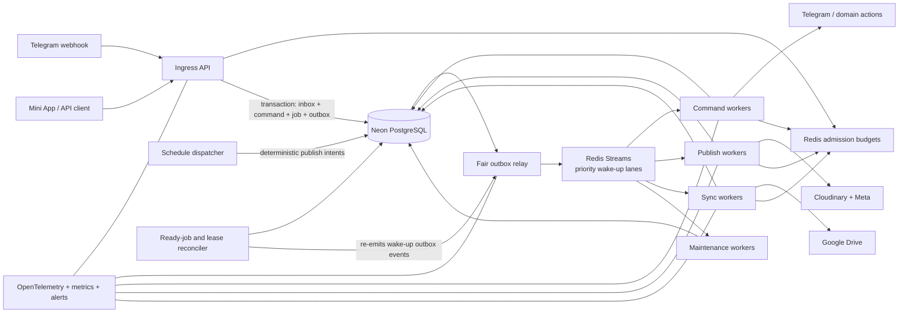

# Epic: Durable High-Throughput Multi-Tenant Storydump

**Date:** 2026-07-29  
**Baseline:** `main` at `683f7cf`  
**Status:** PROPOSED — final architecture review pending  
**Owner:** Storydump maintainers  
**Scope:** Architecture, migration contracts, and acceptance criteria only

## Outcome

Storydump accepts authenticated work quickly, executes it asynchronously with
bounded and fair parallelism, survives replay and worker loss, and prevents
duplicate externally visible effects. Tenants are isolated by default, provider
and database budgets are shared across replicas, and operators can tell whether
the system has capacity to admit more work.

The implementation preserves Python, FastAPI, Railway, Neon PostgreSQL,
Telegram, Meta, Google Drive, and Cloudinary. It also preserves the manual
posting fallback and the current fail-safe behavior for ambiguous publishes.

## Why this is needed

The baseline has meaningful single-process protections:

- Telegram update concurrency is bounded at eight and one PTB application uses
  `AIORateLimiter`.
- Blocking media download and Cloudinary upload calls are offloaded from the
  event loop.
- Meta publishing has a 180-second wall-clock cap and persists a container
  anchor before `media_publish`.
- Posting finalization has an idempotent history write and shared atomic
  transaction paths.
- Some queue claims and transitions use guarded updates or
  `FOR UPDATE SKIP LOCKED`.
- Restart catch-up work is capped at eight tenants per scheduler tick.
- The author-supplied baseline suite result was 2,194 passed and 56
  PostgreSQL-dependent skips; this review did not independently reproduce it.

Those protections do not yet compose into a system-wide guarantee:

- `OperationStateManager` locks, cancellation flags, and in-flight markers are
  process-local. `QueueRepository.claim_for_processing()` commits
  `status='processing'`, but that status remains claimable after the first
  transaction releases its lock.
- SlowAPI uses `memory://`, and the API trusts forwarded hosts with
  `trusted_hosts=["*"]`; limits reset and multiply with replicas.
- PTB pacing is local to one `Application`; API/CLI one-shot bots and another
  worker do not share its bot-token budget.
- Scheduling and media synchronization iterate tenants sequentially.
- Synchronous SQLAlchemy work still runs in async request and callback flows;
  task-local `ContextVar` sessions prevent sharing but do not make I/O async or
  define one explicit transaction lifetime per unit of work.
- Tenant filtering is optional and several tenant-owned foreign keys remain
  nullable for legacy operation.
- The worker combines Telegram polling, scheduling, sync, cleanup, refresh,
  alerts, and health. Replication creates conflicts and duplicate periodic work
  before it creates useful capacity.
- `posting_queue` is deliberately ephemeral. There is no general durable inbox,
  command, leased job, attempt, dead-letter, or transactional outbox model.
- Existing logs and counters do not expose queue age, fairness, admission
  decisions, provider saturation, or duplicate-suppression outcomes.

Repository-specific evidence is evaluated in
[`self-evaluation.md`](self-evaluation.md).

## Capacity contract

### Initial acceptance envelope

| Dimension | Initial target |
|---|---:|
| Provisioned tenants | 1,000 |
| Simultaneously active tenants | 250 |
| Telegram/API click burst | 200 commands in 10 seconds |
| Sustained lightweight API traffic | 50 requests/second |
| Tenants due in one scheduler minute | 250 |
| Media transfers per worker | Configurable; initial cap 4 |
| Meta publish flows per Instagram account | 1 |
| Duplicate external publishes in replay/crash tests | 0 |

### Service-level objectives

- Telegram callback acknowledgement: p95 under 500 ms, p99 under 1 second.
- Valid asynchronous API command admission: p95 under 250 ms, returning
  `202 Accepted` and an operation ID.
- Event-loop lag: p95 below 100 ms and p99 below 500 ms under acceptance load.
- When providers are healthy, 99% of continuously eligible admitted
  high-priority jobs start within 30 seconds.
- When another tenant has queued work, no tenant exceeds its configured fair
  share.
- Command admission availability: 99.9% monthly, excluding documented provider
  outages.
- No admitted command or ambiguous external operation is silently discarded.
- Every admitted operation reaches a terminal or operator-review state.

These are capacity contracts. Lowering one requires an architecture decision
record, not an implementation convenience.

For SLO measurement, `eligible_at` is the later of admission/`available_at` and a
durable external not-before time such as a provider reset. “Start” is the durable
transition to `running`, not stream delivery. Waiting for Storydump's own relay,
worker, fairness, Redis, or database capacity counts against start latency under
the acceptance load; internal saturation cannot make a job ineligible. Fair share
is measured as weighted admitted cost over a defined rolling window; the
fair-dispatch ADR must set the window, one-quantum burst tolerance, and maximum
starvation lag before the SLO can gate rollout.

## First-principles constraints

### Irreducible fundamentals

1. PostgreSQL must durably record intent before Storydump says it accepted intent.
2. Third-party APIs and network responses are fallible and may be ambiguous.
3. Exactly-once transport is unavailable; uniqueness and state machines must make
   replay harmless.
4. Provider budgets are shared at the provider's real scope, which may be bot,
   project, account, environment, tenant, or a combination.
5. A tenant boundary must not depend on every caller remembering an optional
   filter.
6. Long provider waits must not hold an event loop, database transaction, lease
   without heartbeat, or unrelated tenant's capacity.
7. Horizontal scaling is safe only when correctness is independent of process
   memory and replica affinity.
8. Redis can accelerate coordination, but losing Redis cannot erase an accepted
   command.
9. An operator must be able to distinguish not admitted, waiting, running,
   ambiguous, failed, cancelled, and completed work.

### Conventions deliberately rejected

- An HTTP handler does not need to finish the requested work.
- A broker message is not the authoritative job.
- A Redis lock is not the correctness boundary for publishing.
- A queue is not fair merely because consumers are FIFO.
- A `ContextVar`-isolated synchronous session is not an asynchronous unit of
  work.
- A nullable tenant key is not a compatibility feature once backfill is complete.
- CPU utilization alone is not a safe autoscaling signal for provider-bound work.

## Architecture decision

### Selected: evolutionary multi-service architecture

Keep the product, language, integrations, and existing posting safety logic. Add
Redis for non-authoritative distributed coordination, PostgreSQL inbox/command/
job/provider-operation/outbox records, webhook ingress, and independently
scalable workers.

This path preserves the hardest existing invariants and supports phased cutover.
It adds operational roles and requires dual-running legacy and shadow paths while
tenancy and repository boundaries are repaired.

### Considered: PostgreSQL-only coordination

PostgreSQL can safely implement jobs, leases, deterministic schedules, and
outboxes. It remains the fallback correctness model. It was not selected for
high-frequency token buckets because quota writes would compete with product
transactions, and database degradation would also remove the fastest overload
guard.

### Considered: clean-sheet managed event platform

A hosted event bus offers mature routing and replay controls, but creates the
largest migration and operational shift. Rebuilding Meta ambiguity handling,
Telegram card reconciliation, and posting-history invariants creates more risk
than evolving them.

## Target topology

Redis Streams carry low-latency wake-ups. The PostgreSQL job row is the work
record. A worker never performs an effect merely because a stream entry exists;
it first wins a conditional PostgreSQL lease.

## Admission protocol

The ordering below is normative:

1. Enforce body/header size and a coarse unauthenticated edge budget.
2. Verify the provider secret or client authentication. For Telegram, verify
   `X-Telegram-Bot-Api-Secret-Token`; it is a shared webhook secret, not a
   payload signature.
3. Resolve principal, tenant, membership, and role on the server. Never trust a
   client-supplied tenant as authorization.
4. For a supplied idempotency/event key, perform a bounded authenticated lookup
   before charging write capacity. An identical request fingerprint returns the
   original operation. Reuse with a different command namespace/type/payload
   fingerprint returns a conflict and creates no work. This recovery lookup has
   its own small database semaphore and is allowed during Redis degradation
   because it cannot admit new work.
5. Acquire Redis admission budgets for principal, tenant, route cost, and global
   capacity. Redis scripts use Redis server time and update all required buckets
   atomically, so partial token acquisition cannot occur.
6. In one short database transaction, revalidate mutable authorization where
   required and insert or find the inbox event, idempotent command, initial job,
   and outbox event.
7. Commit before returning success. API clients receive `202` plus an operation
   ID for new work; identical retries receive the original operation resource.
8. The outbox relay publishes only after commit.

No network call or Redis wait occurs while the admission write transaction is
open.

### Telegram callback acknowledgement

A successful webhook HTTP response does not itself stop a callback-query spinner;
Storydump must invoke `answerCallbackQuery`. The ingress reserves a fast path:

- For callback updates, return a Bot API `answerCallbackQuery` method in the
  webhook response when the framework adapter supports it. Telegram documents
  this response form, although it does not return the method result.
- If a separate Bot API request is required, place it in a reserved,
  deployment-wide Telegram acknowledgement budget that bulk sends cannot consume.
- The acknowledgement means “received,” not “completed.” Slow work remains a
  durable command.
- If a valid request is explicitly not admitted, acknowledge with a neutral
  retry/error toast and record the rejection metric; do not imply an operation
  was created.

If PostgreSQL is unavailable, API clients receive `503` and Telegram receives a
non-2xx response so its documented webhook retry behavior can apply. If Redis is
unavailable, write/cost-generating commands fail closed and receive an explicit
unavailable response. Authenticated cancellation of an already-admitted operation
is the safety exception: it may use a separately bounded PostgreSQL-direct
conditional update when Redis is unavailable. Callback acknowledgement also
remains available because it does not admit work. A rejected request is not an
admitted operation.

## Service roles

### Ingress API

- Receives Telegram webhooks and Mini App/API commands.
- Validates secrets, authentication, authorization, membership, replay metadata,
  content type, and streamed size.
- Applies shared admission and abuse budgets.
- Writes inbox, command, initial job, and outbox rows atomically.
- Returns an operation resource; it never waits for ordinary worker completion.
- Never downloads media, performs a full sync, calls Meta, or uploads to
  Cloudinary.

Polling remains only as a feature-flagged rollback path during migration. It is
not horizontally scalable for one bot token because `getUpdates` and webhooks are
mutually exclusive, and competing pollers conflict.

### Fair outbox relay

- Claims eligible outbox rows in bounded transactions with
  `FOR UPDATE SKIP LOCKED`.
- Permanently excludes `shadow_only` events from live broker publication.
- Selects a bounded tenant quantum per pass and orders tenants by persisted last
  dispatch, then orders each tenant's work by priority, deadline, and age.
- Publishes into queue- and priority-specific Redis Streams.
- Records publication attempt, broker ID, and next retry without treating broker
  publication as job completion.
- On poison, atomically moves the associated job and command to quiescent
  `review_required`; relay, scanners, and lease queries exclude them. Operator
  resolution creates an audited replacement generation/job rather than reviving
  the poison row.

### Schedule dispatcher

- Pages through due tenants with a persisted cursor/fair order.
- Inserts deterministic publish intents with a unique business key such as
  `(tenant_id, schedule_slot_at, intent_type)`.
- Does not transfer media or call a provider.
- Can run in multiple replicas because uniqueness collapses duplicate discovery.

### Command workers

Execute ordinary domain actions and Telegram card mutations. Fast acknowledgements
remain reserved at ingress; worker messages use shared Telegram bot and chat
budgets.

### Publish workers

Execute media preparation and the persisted Meta create/poll/publish state
machine. A PostgreSQL invariant allows at most one active publish operation per
Instagram account. Redis paces provider calls but is not the serialization proof.

### Sync workers

Page Drive changes/listings, stream downloads through bounded temporary storage,
and reconcile media in batches. They have independent process, provider, tenant,
and database concurrency caps.

### Maintenance workers

Handle lease recovery, ready-job wake-up recovery, dead-letter workflows, token
refresh, retention, cloud cleanup, and provider reconciliation. Maintenance jobs
are deterministic or uniquely keyed so multiple replicas are safe.

## Durable data model

Exact DDL belongs to migration review. These semantics are required.

### `inbox_events`

Immutable receipt metadata:

- provider, non-secret provider account/environment identity, and provider event
  ID;
- resolved tenant and principal where available;
- verification result and receipt timestamp;
- payload digest and a minimal sanitized envelope, not reusable credentials.

Unique `(provider, provider_account_id, provider_event_id)` makes webhook replay
safe without colliding across bot/provider accounts. Retention must preserve
deduplication for at least the provider's replay horizon.

### `commands`

One accepted user or system intent:

- operation ID, tenant, principal, command namespace/type, normalized sanitized
  payload and request fingerprint;
- tenant-scoped idempotency key, immutable execution mode (`live` or
  `shadow_only`), priority, status, cancellation request;
- result/error reference and terminal reason;
- trace and audit metadata.

Unique `(tenant_id, command_namespace, idempotency_key, execution_mode)` returns
the original operation only when its request fingerprint matches. A mismatch is
an idempotency conflict. `shadow_only` is permanent and lives in a separate
idempotency namespace; cutover creates new `live` work for new requests and never
activates historical shadow rows.

Normative automatic command transitions:

| From | Allowed to |
|---|---|
| `accepted` | `queued`, `cancelled`, `failed`, `review_required` |
| `queued` | `running`, `cancelled`, `failed`, `review_required` |
| `running` | `queued` (classified retry), `cancelling`, `succeeded`, `failed`, `review_required` |
| `cancelling` | `cancelled`, `succeeded`, `failed`, `review_required` |
| `review_required` | no automatic transition; audited operator resolution may queue reconciliation or choose a terminal state |
| terminal (`succeeded`, `failed`, `cancelled`) | none |

Cancellation is cooperative. Once a third-party effect may have started, the
command cannot claim cancellation until the effect is reconciled.
`review_required` is quiescent and never auto-retries; it is operator-visible,
not silently terminal.

### `jobs`

One leased execution unit:

- queue, kind, tenant, command, immutable execution mode, priority, cost, and
  provider key;
- `ready`, `leased`, `running`, `waiting`, and terminal states;
- availability time, deadline, lease owner/expiry, heartbeat, attempt limits;
- sanitized terminal reason and payload/result references.

Claims and transitions are single conditional updates. A claim succeeds only
from `ready` with no live lease and `execution_mode='live'`; `shadow_only` jobs
are permanently excluded. A due `waiting` job is first atomically promoted to
`ready` with a new wake-up outbox event. `running` is never generally claimable.
Lease expiry changes pre-effect work back to recoverable work through a reaper.
If a provider operation records that an effect may have started, expiry moves the
job to reconciliation/review and never generic retry.

### `job_attempts`

Append-only attempt timing, worker identity, classified outcome, retry decision,
and sanitized error. It must not contain provider tokens, signed URLs, init data,
OAuth state, or full third-party bodies.

### `provider_operations`

The durable external-effect state machine:

- tenant, provider, operation kind, unique business key, account/environment key;
- provider request ID, container/upload/message/story identifiers;
- current phase, ambiguity classification, last safe retry decision;
- timestamps for requested, acknowledged, reconciled, and terminal phases.

For Meta, persist the container before `media_publish`, plus publish-request time,
response classification, story ID when known, and ambiguity state. A unique
business key prevents a second provider operation for one publish intent.

### `outbox_events`

Messages created in the same transaction as domain changes:

- aggregate and event identity, tenant, queue/priority, sanitized payload;
- availability, dispatch lease, attempt count, next retry;
- broker message ID, publication timestamp, and terminal/operator-review reason.

An outbox publication flag is not a permanent delivery proof. The ready-job
reconciler periodically promotes due `waiting` jobs and finds `ready` jobs that
have no live lease or recent wake-up. In the same transaction it increments the
job's monotonic `wakeup_generation`, stamps `last_wakeup_at`, and inserts an event
unique on `(job_id, wakeup_generation, event_type)`. A cooldown bounds duplicate
generations while a conditional update prevents concurrent scanners from using
the same generation. This closes both delayed-wake and post-publication
Redis-loss windows.

### `tenant_dispatch_state`

Persists dispatch weight, concurrency ceiling, last-dispatched time or virtual
finish, and temporary suspension. It supports deterministic fair relay selection
without depending on stream FIFO order.

### `rate_limit_observations`

Stores slow provider budget observations, reset hints, and provenance for
forecasting and operations. High-frequency token counts remain in Redis.

## Broker and lease semantics

Delivery is at least once:

1. Relay publishes a wake-up and records its broker ID.
2. A consumer reads with bounded prefetch.
3. The worker wins a PostgreSQL job lease before doing work.
4. If the job is already leased, terminal, cancelled, or not yet available, the
   message can be acknowledged without an effect.
5. The stream message is acknowledged only after the lease decision is durable.
6. A worker crash leaves a Redis pending entry and a PostgreSQL lease. Stream
   reclaim and lease expiry may race; the conditional database transition
   decides the winner.
7. A lease heartbeat extends only while the worker owns the same lease token.
8. Long provider waits release database transactions but keep a bounded lease
   heartbeat. Before an external effect, the worker atomically records an
   irreversible one-shot effect permit (`effect_may_have_started`) bound to its
   lease token, then rechecks ownership immediately before send. No successor may
   issue that effect: it can only reconcile/review. A pause in the unavoidable
   post-check/pre-send gap means the stale permit holder may still issue the sole
   call after lease loss; PostgreSQL cannot interrupt it. The stale holder cannot
   issue a second call or finalize, and the reaper routes the operation to
   reconciliation/review.
9. Periodic due-waiting promotion and ready-job scans guarantee eventual wake-up
   independently of outbox and stream delivery flags.

Stream retention, persistence, and memory policy are operational safeguards, not
correctness assumptions.

## Idempotency and external-effect safety

The promise is at-least-once processing with effectively-once domain effects.

- Telegram idempotency key: provider account, update/callback-query ID, and
  normalized action.
- API idempotency key: required `Idempotency-Key` for mutating asynchronous
  routes, tenant/command-namespace scoped and fingerprint checked.
- Schedule intent key: tenant, slot time, and intent type.
- Worker effect key: command/job business key enforced in PostgreSQL.
- Provider idempotency key: use when the provider supports it.
- Database finalization: one idempotent transaction.

### Meta ambiguity

Meta publishing is not assumed to provide a client idempotency key:

1. Create or resume one `provider_operations` row for the publish intent.
2. Persist the Meta container ID before `media_publish`.
3. Mark `publish_requested` before the outbound call.
4. Classify the response as confirmed success, confirmed safe failure, transient
   pre-effect failure, or ambiguous.
5. Retry only confirmed pre-effect or provider-confirmed failed states.
6. Reconcile ambiguous states using provider evidence. If evidence cannot prove a
   safe retry, move to `review_required`; never call `media_publish` again.

The zero-duplicate acceptance test is achieved by refusing unsafe replay, not by
claiming the third-party API is exactly once.

### Other ambiguous effects

Telegram send timeouts and any provider call that can succeed without a response
use the same provider-operation classification. A follow-on send is allowed only
when the first effect is known not to have occurred or the provider accepts a
stable idempotency key.

## Hierarchical capacity and rate control

Every dispatch acquires all applicable budgets:

| Layer | Example key | Result |
|---|---|---|
| unauthenticated edge | trusted client IP + route | reject abusive ingress |
| principal | tenant + principal + command cost | reject or defer user bursts |
| tenant admission | tenant + operation class | preserve configured fair share |
| global service | deployment + queue | shed before DB/provider saturation |
| Telegram | bot token, then target chat | reserve callback/cancellation capacity |
| Meta | app/use case, Instagram account, publish quota | serialize per account and delay to reset |
| Drive | Cloud project and connected user, weighted units | page, back off, and jitter |
| Cloudinary | product environment and tenant upload pool | cap parallelism; reduce after HTTP 420 |
| database | deployment connection budget + worker semaphore | reject/defer before pool waits hang |

Redis bucket decisions are atomic Lua functions. A multi-bucket request either
consumes every required budget or none. Keys expire, configuration is versioned,
and labels match the provider's actual shared scope rather than mechanically
including a tenant.

Priority lanes reserve capacity for callback acknowledgement, cancellation, and
reconciliation. Bulk sync cannot borrow the last reserved slots.

### Failure policy

- Fail closed for unauthenticated, write, upload, publish, and cost-generating
  operations when shared admission is unavailable.
- Allow only explicitly enumerated health/cached reads, bounded authenticated
  idempotency recovery lookups, callback acknowledgements, and cancellation
  requests for already-admitted operations during Redis degradation.
- Emit `admission_limiter_unavailable`, distinct from application/provider
  failures.
- Never accept work only into Redis.

### Fairness

Redis consumer groups provide distribution, not tenant fairness. Fairness is
enforced before dispatch:

- distinct streams for queue and priority isolate failure classes;
- each relay pass takes a bounded weighted quantum per eligible tenant;
- tenants are ordered by persisted virtual finish/last dispatch;
- per-tenant and per-provider active-lease caps prevent one tenant from occupying
  all workers;
- age promotion prevents low-priority starvation;
- high-priority reservation has a configured ceiling so ordinary work still
  progresses;
- the fairness load test asserts peer start latency when one tenant supplies 90%
  of the backlog.

The fair-dispatch ADR defines weighted cost, measurement window, quantum, and
starvation bound. “Fair” is not satisfied merely by equal job counts when job
costs differ.

## Database and tenant isolation

### Ownership contract

- Classify every table as deployment-global, tenant-owned, or relationship/audit.
- Backfill tenant ownership before making each tenant key non-null.
- Require tenant ID in service/repository interfaces for tenant-owned operations;
  reject `None` before constructing SQL.
- Add tenant-aware composite foreign keys and unique constraints when identifiers
  cross aggregates.
- Keep global maintenance queries in explicitly named privileged interfaces, not
  optional tenant parameters.

`chat_settings_id` can remain the physical key during migration; service
boundaries use the neutral `tenant_id` concept and map it explicitly.

### Row-Level Security

- Runtime services use a non-owner role without `BYPASSRLS`.
- Tenant-owned tables enable and, where appropriate, force RLS.
- Every transaction that touches tenant-owned data executes transaction-local
  tenant context, for example
  `SELECT set_config('app.tenant_id', :tenant_id, true)`.
- Policies use a missing-safe lookup such as
  `NULLIF(current_setting('app.tenant_id', true), '')::uuid`; absent context
  yields default denial.
- `WITH CHECK` prevents inserts and updates from changing ownership.
- Privileged maintenance uses a separate narrowly controlled role and separately
  tested code paths.
- Tests connect as the production application role and prove both allowed access
  and cross-tenant denial. Owner-role tests are insufficient.

`SET LOCAL`/transaction-local `set_config` ends with the transaction, so the
design does not rely on session state surviving Neon's PgBouncer transaction
pooling.

### Unit of work and connection budget

- Use one SQLAlchemy `AsyncSession` per API request or worker task.
- Never share a session across concurrent tasks.
- Open transactions only around database work and close them before provider
  waits.
- Replace commit monkey-patching and long-lived repository sessions with explicit
  unit-of-work scopes.
- Use the Neon pooled endpoint for runtime and a direct endpoint for migration
  tooling that requires session features.
- Configure per-role/per-service pool and semaphore budgets whose sum fits the
  deployment's global database budget.
- Apply short connection acquisition, statement, lock, transaction, and
  idle-in-transaction limits appropriate to each work class.

The implementation does not use session advisory locks, `LISTEN/NOTIFY`, or
session-local state for correctness.

## External I/O and memory safety

- Reuse lifecycle-managed async HTTP clients with explicit connection limits.
- Separate connect, read, write, pool, and total-operation deadlines.
- Stream Drive downloads into bounded temporary files or streaming Cloudinary
  uploads; never materialize arbitrary concurrent media as `bytes`.
- Use chunked upload where required for large Cloudinary assets.
- Bound thread offload separately from async worker concurrency.
- Give an operation one retry budget and absolute deadline; nested layers do not
  each multiply retries.
- Retry only classified transient failures with exponential backoff and full
  jitter, honoring `Retry-After` and provider usage/reset headers.
- Validate egress protocol, host, DNS/IP before and after redirects, content
  length while streaming, and final byte limit.
- Redact credentials, signed URLs, Telegram init data, OAuth state, and full
  provider response bodies from traces, logs, attempts, and outbox payloads.

## Failure contract

| Failure | Required behavior |
|---|---|
| duplicate click/webhook | return existing operation; no second job/effect |
| worker crash before provider call | lease expires; safe retry |
| crash after provider call before finalization | reconcile provider operation; never blind retry |
| Redis unavailable before admission | fail closed for writes/costly work; explicit rejection |
| Redis message lost after outbox publication | generation-based ready-job reconciler emits another wake-up |
| delayed-job wake-up lost | promote due `waiting` to `ready` and emit a generation-based wake-up |
| outbox poison event | command becomes operator-visible review/failure; no silent stall |
| PostgreSQL unavailable | fail fast; never claim durable acceptance |
| Telegram rate limit | delay lower-priority sends; preserve acknowledgement/cancellation reserve |
| Meta quota exhausted | schedule next safe window; retain manual controls |
| Drive/Cloudinary throttle | lower provider concurrency; retry with jitter |
| tenant backlog | weighted relay and tenant concurrency preserve peer progress |
| worker loses lease | prevent new effects/finalization; reconcile any call already issued |
| cancellation during provider call | record requested; reconcile before declaring cancelled |
| historical shadow job after cutover | remains permanently non-leaseable; never flip to live |
| poison job | bounded attempts, sanitized terminal reason, operator workflow |

## Observability and admission safety

Every command/job carries `trace_id`, `operation_id`, `tenant_id`, `job_id`,
attempt, provider, and sanitized provider request ID. Raw tenant/operation IDs
belong in traces and logs, not metric labels.

Required signals:

- ingress RPS, explicit rejections, idempotency hits, auth failures, and callback
  acknowledgement latency;
- command status counts and terminal/review age;
- ready depth and oldest-ready age by queue/priority;
- lease age, expiry, renewal, attempts, retries, dead letters, and reconciliation;
- tenant fairness distribution and peer lag quantiles;
- event-loop lag, thread pool use, active work, memory, and CPU;
- DB pool wait/checkouts, transaction and lock duration, statement timeout, and
  RLS denials;
- provider latency/status/retry-after/budget/circuit state;
- duplicate suppression and ambiguous-operation backlog;
- outbox age, publication failures, stream pending age, and ready-job wake-up
  recoveries;
- SLO burn rates and a deployment capacity dashboard.

Admission is safe only while all of these stay inside configured gates:

- oldest high-priority ready age;
- free worker/provider/database concurrency;
- database pool wait and transaction latency;
- provider headroom and ambiguity backlog;
- Redis/relay/reconciler health;
- dead-letter/review backlog.

Autoscaling uses queue age and active-job saturation, not CPU alone. Scaling
replicas never changes provider or database limits implicitly.

## Security model

- Authenticate before trusting principal/tenant rate identities; retain a coarse
  unauthenticated source limit.
- Replace `trusted_hosts=["*"]` with a tested Railway ingress trust boundary.
  Railway currently documents `X-Real-IP` for client identity; implementation
  must verify overwrite/spoof behavior in the deployed topology before using it.
- Bind every authorization decision to server-resolved tenant, active membership,
  and role.
- Put Telegram init data in an authorization header; validate bounded past and
  future skew and consume replay identifiers.
- Bind OAuth state to provider and consume it once.
- Encrypt provider credentials with versioned keys and support online rotation.
- Use private networking, credentials, TLS where applicable, key prefixes, and
  least privilege for Redis and queues.
- Record immutable actor, tenant, operation, effect, and outcome audit fields.
- Preserve dry-run defaults, manual posting fallback, and operator review for
  ambiguity.

## Testing and proof

### Unit and contract tests

- limiter key scope, weighted costs, multi-bucket atomicity, reservations, jitter,
  and fail policy;
- command idempotency, state transitions, cancellation, leases, and heartbeats;
- provider classification and sanitized persistence;
- tenant context propagation and fail-closed repositories;
- pinned adapter behavior for Telegram, Meta, Drive, Cloudinary, Redis,
  SQLAlchemy, Neon, and Railway assumptions.

### PostgreSQL and Redis integration tests

- build schema by replaying migrations, not ORM `create_all()`;
- claim concurrently through separate processes/connections;
- prove uniqueness collapses double-click and schedule-intent races;
- prove idempotency-key reuse with a different fingerprint returns conflict;
- connect as the runtime role and prove RLS allow/deny behavior;
- kill workers at each provider state boundary and prove recovery;
- pause after one-shot effect-permit commit, expire the lease, run a successor,
  then resume the stale holder; assert at most one provider call and no stale
  finalization;
- stop Redis between database commit and publish, then prove recovery;
- lose a published or delayed-job stream message and prove generation-based
  recovery re-emits it;
- prove historical `shadow_only` jobs remain non-leaseable after live dispatch is
  enabled;
- test PgBouncer transaction-mode compatibility.

### Load and resilience tests

- 200 clicks in 10 seconds across one and many tenants;
- 250 due tenants in one minute;
- slow provider injection without callback/API latency collapse;
- 429/420 storms without a retry herd;
- DB pool saturation with fast admission shedding;
- rolling deploy and multi-replica replay with zero duplicate publishes;
- one tenant contributes 90% of work while peers remain within SLO;
- Redis restart, stream trimming/loss, worker kill, webhook replay, and ambiguous
  Meta response drills.

Tests must use fake/sandbox adapters. No acceptance test may post to a production
Instagram or Telegram destination.

## Migration and rollback

### Phase 1 — Measure and constrain

Add operation IDs, event-loop/queue/pool metrics, explicit concurrency controls,
shared clients, retry budgets, and load harnesses without changing posting
decisions.

**Gate:** baseline SLO measurements and a reproducible acceptance harness.  
**Rollback:** disable instrumentation/export and retain local behavior.

### Phase 2 — Tenancy and durable idempotency

Establish migration replay, backfill ownership, make interfaces fail closed, add
tenant-aware constraints, and introduce commands/jobs/provider operations.

**Gate:** migrated PostgreSQL concurrency and cross-tenant denial suites.  
**Rollback:** stop writing new records; do not drop audit/idempotency data.

### Phase 3 — Outbox and shadow jobs

Create commands, jobs, provider operations, and outbox events in parallel with
the legacy path. Shadow rows carry immutable `execution_mode='shadow_only'` and
lease queries permanently exclude them; compare decisions and cardinality.

**Gate:** every legacy action maps one-to-one to a shadow operation and no shadow
path performs an external effect. Enabling live dispatch does not make any
historical shadow job leaseable.  
**Rollback:** disable shadow writes after preserving diagnostics.

### Phase 4 — Shared Redis admission and wake-ups

Replace `memory://` limits, implement provider budgets and priority streams, and
prove outbox plus ready-job recovery.

**Gate:** Redis-loss and published-message-loss drills pass.  
**Rollback:** disable new command admission/dispatch; legacy path remains
available only within its safe single-replica envelope.

### Phase 5 — Extract ingress and workers

Move Telegram to webhooks, then route quick commands, media sync, and manual
posting finalization through workers.

**Gate:** callback/API SLOs, idempotency, fairness, and rolling-restart tests pass.  
**Rollback:** disable route cohorts and restore one polling worker; preserve
accepted jobs and outbox rows.

### Phase 6 — Publish state-machine cutover

Canary tenants through the durable provider-operation flow. Keep manual posting
fallback and reconciliation dashboards.

**Gate:** crash tests at every Meta boundary and zero unsafe retries.  
**Rollback:** stop admitting new automated publish jobs; reconcile all in-flight
operations before returning a tenant to legacy routing.

### Phase 7 — Scale and enforce RLS

Enable replicas after distributed tests. Run RLS tests/audit first, then enforce
with the non-owner runtime role.

**Gate:** cross-tenant denial, pool budget, and load/resilience suites.  
**Rollback:** route to one replica or disable a cohort; do not revert ownership
backfills or weaken policies to recover traffic.

### Phase 8 — Retire legacy process state

Remove polling, in-memory operation coordination, embedded periodic loops, and
long-lived synchronous sessions only after no rollback cohort depends on them.

Each phase has an independent kill switch. Rollback stops new routing; it never
deletes jobs, outbox rows, provider anchors, or audit history.

## Acceptance criteria

The epic is complete only when:

- the capacity envelope and latency SLOs pass in a versioned load environment;
- duplicate command and schedule-intent tests collapse to one operation;
- every worker-kill boundary recovers to success, failure, cancellation, or
  operator review;
- no replay/crash drill emits a second external publish;
- Redis loss cannot lose a PostgreSQL-ready job;
- one-tenant flood tests preserve peer start-latency SLOs;
- tenant-owned repository calls reject missing tenant context and RLS blocks
  cross-tenant access using the runtime role;
- connection use stays within the configured global budget during replica scale;
- ambiguous Meta operations and poison work are visible and actionable;
- every production cutover has a tested cohort rollback.

## Non-goals

- Changing Storydump's product workflow or removing manual fallback.
- Triggering production posting or mutating production queue/history.
- Claiming third-party APIs provide end-to-end exactly once.
- Adopting Kubernetes, a new language, or one microservice per class.
- Multi-region active/active publishing before single-region correctness.
- Maximizing call volume at the expense of safety, fairness, or account health.

## Sources to re-verify at implementation

The following were checked on 2026-07-30 and must be checked again when their
phase is implemented:

- [Railway scaling](https://docs.railway.com/deployments/scaling) — random
  replica distribution and no sticky sessions.
- [Railway workers and queues](https://docs.railway.com/guides/cron-workers-queues)
  — queue/worker trade-offs and Redis-loss caveat.
- [Railway public networking](https://docs.railway.com/networking/public-networking/specs-and-limits)
  — current ingress headers, including `X-Real-IP`.
- [Neon connection pooling](https://neon.com/docs/connect/connection-pooling) —
  transaction-mode PgBouncer and unsupported session features.
- [PostgreSQL RLS](https://www.postgresql.org/docs/current/ddl-rowsecurity.html) —
  default denial, owner/BYPASSRLS behavior, and `FORCE ROW LEVEL SECURITY`.
- [PostgreSQL `SET`](https://www.postgresql.org/docs/current/sql-set.html) —
  transaction-local context lifetime.
- [SQLAlchemy session concurrency](https://docs.sqlalchemy.org/en/20/orm/session_basics.html#is-the-session-thread-safe-is-asyncsession-safe-to-share-in-concurrent-tasks)
  — one session per thread and one `AsyncSession` per task.
- [Telegram webhooks](https://core.telegram.org/bots/api#setwebhook) — secret
  header, retry behavior, update IDs, and webhook-response Bot API calls.
- [PTB `AIORateLimiter`](https://docs.python-telegram-bot.org/en/stable/telegram.ext.aioratelimiter.html)
  — process-local reference limiter and global halt after `RetryAfter`.
- [Redis rate limiting](https://redis.io/docs/latest/develop/use-cases/rate-limiter/)
  — shared atomic Lua decisions.
- [Redis Streams](https://redis.io/docs/latest/develop/data-types/streams/) —
  consumer groups, explicit acknowledgement, pending-entry recovery, and
  retention.
- [Google Drive limits](https://developers.google.com/workspace/drive/api/guides/limits)
  — weighted project/user quotas and truncated backoff.
- [Cloudinary uploads](https://cloudinary.com/documentation/upload_images#parallel_uploads_and_rate_limiting)
  — modest starting concurrency, HTTP 420 response, and backoff.
- [Meta Instagram API workspace](https://www.postman.com/meta/instagram/documentation/6yqw8pt/instagram-api)
  — adapter shape and current publishing capabilities.
- [Meta `content_publishing_limit`](https://developers.facebook.com/docs/instagram-platform/instagram-graph-api/reference/ig-user/content_publishing_limit/)
  — live `quota_usage` and `config` response. Meta's prose pages currently show
  inconsistent fixed totals, so the live account response remains authoritative.
