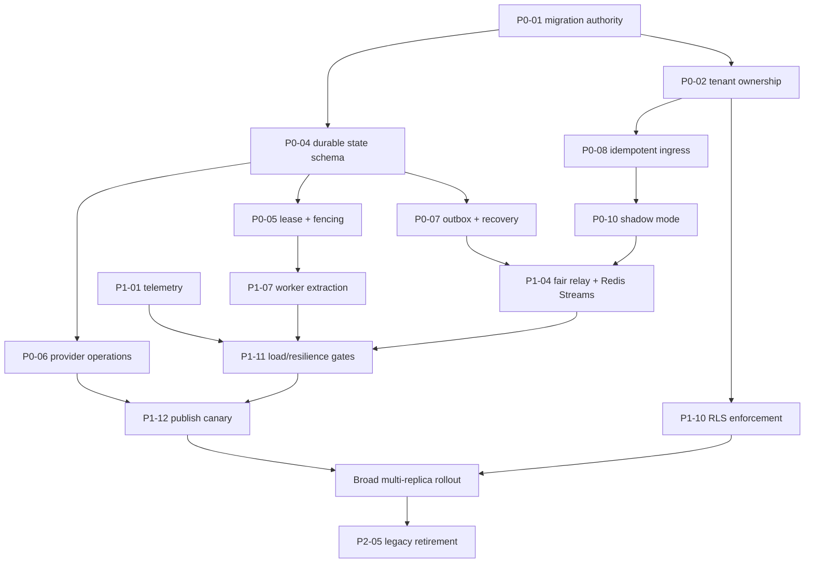

> **⛔ SUPERSEDED — DO NOT IMPLEMENT FROM THIS DOCUMENT.** The authoritative plan is [`../2026-08-02-consolidated-design-plan/`](../2026-08-02-consolidated-design-plan/README.md); every increment, gate, and shape this file proposed is restated or struck there. Retained only as historical input and evidence for the reviews that cite it.

# Tiered Issue Triage

**Epic:** [`epic.md`](epic.md)  
**Baseline:** `main` at `683f7cf`  
**Status:** Proposed work packages; no implementation authorized

This tracker decomposes the architecture into reviewable outcomes. Priority
describes dependency and correctness risk, not urgency to mutate production.
Existing `TD-NNN` references point to the July system review; several individual
findings have since been fixed, so status must be re-verified at pickup.

## Priority definitions

| Tier | Meaning |
|---|---|
| **P0** | Correctness foundation required before any new path can perform an external effect |
| **P1** | Required before broad multi-replica production admission or completed cutover; narrowly allowlisted canaries may validate earlier steps after their stated gates |
| **P2** | Required for full operational maturity and retirement of legacy loops |
| **P3** | Deferred optimization or later scale capability; not needed for the initial envelope |

## Dependency spine

## P0 — correctness foundation

### P0-01 — Reproducible migration authority

**Outcome:** A clean PostgreSQL database is built by replaying versioned
migrations, and CI proves migrated schema behavior.

**Evidence:** The repository has 49 numbered SQL migrations, while tests still
use ORM `create_all()` in important paths. See TD-070, TD-071, and TD-100.

**Includes:**

- Decide Alembic versus a formal numbered-SQL runner.
- Add transactional/non-transactional phases, rollback policy, checksum/version
  tracking, postconditions, and direct Neon endpoint guidance.
- Detect migration 023's version stamp before its out-of-transaction concurrent
  index and repair/baseline the postcondition before considering it complete.
- Replace schema-building fixtures for migration integration tests.
- Introspect critical constraints/indexes as CI assertions.

**Depends on:** none.  
**Exit:** current migrations replay from empty; schema-parity tests detect a
missing partial index/check; no production migration is run.

### P0-02 — Complete tenant-ownership inventory and fail-closed interfaces

**Outcome:** Every table and interface is classified as deployment-global or
tenant-owned; tenant-owned access cannot silently run without context.

**Evidence:** `BaseRepository._apply_tenant_filter(..., None)` is a no-op.
`media_items`, `posting_queue`, `posting_history`, locks, categories, and token
ownership include nullable legacy tenant keys. See EPIC-A and TD-031b.

**Includes:**

- Inventory rows, producers, readers, foreign keys, uniqueness, and legacy NULLs.
- Require tenant ID in service/repository APIs; create explicitly named global
  maintenance methods.
- Design idempotent backfills, preflight counts, validation constraints, and
  eventual `NOT NULL`.
- Add composite tenant-aware constraints where aggregate IDs cross boundaries.

**Depends on:** P0-01.  
**Exit:** missing-context tests fail closed, cross-tenant tests cover every
tenant-owned repository, and each backfill has a reviewed rollback/stop rule.

### P0-03 — Race-safe posting finalization uniqueness

**Outcome:** Replayed finalization cannot create duplicate history or apply
domain counters twice.

**Evidence:** `HistoryRepository.create_idempotent()` is an application-level
read-then-insert. `PostingHistory.queue_item_id` has no unique constraint, and
the changelog records existing duplicate production groups discovered during a
dry run.

**Includes:**

- Define the permanent business key for posting finalization.
- Produce a review-only duplicate report and human-approved remediation plan.
- Add a validated unique constraint/index after duplicates are resolved.
- Make history, media counters, lock, queue/job terminal state, user stats, and
  follow-on outbox events one transaction.

**Depends on:** P0-01, P0-02.  
**Exit:** concurrent finalize tests through separate connections produce one
history/effect update. Production data is not changed without separate approval.

### P0-04 — Durable commands, jobs, attempts, and transition vocabulary

**Outcome:** Every admitted operation has an authoritative state and a legal path
to success, failure, cancellation, or operator review.

**Evidence:** `PostingQueue` is explicitly ephemeral and deleted after
completion. No command, general job, attempt, or dead-letter model exists.

**Includes:**

- `inbox_events`, `commands`, `jobs`, and `job_attempts` models/migrations.
- Provider-account-scoped inbox keys, tenant/command-namespaced idempotency,
  request fingerprints, immutable `live`/`shadow_only` execution mode, and
  deterministic schedule-intent keys.
- Enumerated legal transitions implemented as conditional updates.
- Deadlines, retry budgets, sanitized terminal reasons, and audit fields.
- Cancellation-request semantics distinct from confirmed cancellation.

**Depends on:** P0-01, P0-02.  
**Exit:** model-based and concurrent integration tests reject every illegal or
double transition and prove one operation is returned for duplicate admission.

### P0-05 — Lease ownership, heartbeat, fencing, and recovery

**Outcome:** A committed running job cannot be casually re-claimed, and a stale
worker cannot finalize after lease loss.

**Evidence:** `claim_for_processing()` accepts committed `processing` rows. The
current concurrency test proves only lock overlap while one transaction is held.
See TD-014.

**Includes:**

- Atomic due-`waiting` promotion to `ready`, then conditional claim from `ready`.
- Lease owner plus random/fencing token, expiry, heartbeat, and attempt row.
- Token-matched renew/finalize/release operations.
- Bounded lease reaper and graceful shutdown behavior. Only proven pre-effect
  work returns to ready; `effect_may_have_started` enters reconciliation/review.
- Irreversible one-shot effect permit bound to a lease token. Successors only
  reconcile; the stale holder may issue the sole call in the unavoidable
  post-check/pre-send pause window but cannot issue twice or finalize.
- Tests with separate processes and paused stale workers.

**Depends on:** P0-04.  
**Exit:** one live owner, expired work recovers, and a resumed stale owner cannot
call finalization or create a second provider effect.

### P0-06 — Durable provider operations and Meta ambiguity

**Outcome:** External effects have a unique business key and persisted state
machine; ambiguous Meta publishes are never blindly retried.

**Evidence:** Existing scheduler/autopost paths persist
`instagram_container_id` with `status='publishing'` before publish. This is strong
but tied to the ephemeral queue row and lacks a general reconciliation record.

**Includes:**

- `provider_operations` model and unique business key.
- Meta create/poll/publish phases, response classifications, and reconciliation.
- One active publish operation per Instagram account enforced in PostgreSQL.
- Operator-review state and manual fallback.
- Equivalent ambiguity classification for Telegram sends and other visible
  effects.

**Depends on:** P0-03, P0-04, P0-05.  
**Exit:** kill/drop-response tests at every Meta boundary issue at most one
publish call and always produce a terminal or review state.

### P0-07 — Transactional outbox plus ready-job recovery

**Outcome:** Domain changes and follow-on work are atomic, and loss of a
published Redis message cannot strand a ready PostgreSQL job.

**Evidence:** No outbox exists. Recording a broker ID alone leaves a failure
window after Redis publication.

**Includes:**

- `outbox_events` with dispatch leases, attempts, retry time, broker ID, and
  operator-review state.
- Bounded `SKIP LOCKED` relay.
- Consumer acknowledgement contract.
- Due-waiting promotion plus a ready/unleased-job scanner that atomically
  increments a monotonic wake-up generation and emits an event unique to that
  generation, regardless of prior publication state.
- Poison handling atomically moves job and command to quiescent review so relay,
  recovery scans, and lease queries exclude them; operator resolution creates an
  audited replacement.

**Depends on:** P0-04, P0-05.  
**Exit:** Redis is stopped before publish and messages are lost after recorded
publish; both cases recover one job with no duplicate effect.

### P0-08 — Idempotent ingress and explicit callback acknowledgement

**Outcome:** API/Telegram admission is fast, authenticated, replay-safe, and
unambiguous to clients.

**Evidence:** Current Telegram uses polling. Existing callback handlers answer
early in several paths, but there is no webhook inbox/command transaction.
Telegram distinguishes webhook HTTP success from `answerCallbackQuery`.

**Includes:**

- Telegram secret-header validation and update/callback idempotency.
- API `Idempotency-Key` contract, command/payload fingerprint conflict behavior,
  and operation resource.
- Bounded authenticated duplicate lookup before write-capacity charging so a
  lost response can recover the original operation during Redis degradation.
- Normative auth → duplicate lookup → shared write limit → transaction → response
  ordering.
- Fast callback-answer adapter and reserved Telegram budget.
- PostgreSQL/Redis degradation responses and metrics.
- Webhook/polling feature flags with pending-update-safe rollback.
- Removal/test of the current polling path's `drop_pending_updates=True` before
  webhook cutover.

**Depends on:** P0-02, P0-04, P0-07.  
**Exit:** 200 replayed callbacks create one command; API retries return the same
operation; callback acknowledgement SLO is measured under slow-worker injection.

### P0-09 — Schema-safe runtime roles and RLS harness

**Outcome:** RLS policies can be developed and tested without relying on an owner
role or session affinity.

**Evidence:** Tenant filtering is currently an application convention. PostgreSQL
owners and `BYPASSRLS` roles bypass ordinary RLS; Neon pools in transaction mode.

**Includes:**

- Runtime, read-only, migration, and maintenance role definitions.
- Transaction-local tenant-context helper.
- Default-deny policy templates with `WITH CHECK`.
- Runtime-role positive/negative integration fixture through the pooled endpoint.
- Integrity-error/existence-oracle review.

**Depends on:** P0-01, P0-02.  
**Exit:** absent/wrong context cannot read or mutate tenant rows when connected as
the exact runtime role; transaction reuse does not leak context.

### P0-10 — No-effect shadow mode

**Outcome:** Legacy actions dual-write commands/jobs/provider-operation/outbox
records for comparison while the new path is technically unable to dispatch.

**Evidence:** Migration requires comparing decisions without risking duplicate
Telegram or Meta effects.

**Includes:**

- Shadow-write feature flag plus immutable `execution_mode='shadow_only'`; relay
  and lease SQL permanently exclude shadow rows even after live dispatch is
  enabled.
- New live requests create distinct `live` work; historical shadow rows are never
  activated.
- Legacy-to-shadow correlation IDs and decision comparison.
- Census for missing, duplicate, or divergent shadow operations.
- No-effect adapter that rejects every outbound provider call in shadow workers.

**Depends on:** P0-03 through P0-08.  
**Exit:** acceptance traffic maps one legacy action to one shadow operation,
provider fake call counts remain zero, and enabling live dispatch still cannot
lease historical shadow jobs.

## P1 — multi-replica production readiness

### P1-01 — Capacity telemetry and load harness

Add OpenTelemetry, bounded-cardinality metrics, event-loop lag, DB pool wait,
queue age, lease recovery, duplicate suppression, provider budgets, ambiguity,
and fairness signals. Build versioned 200-click and 250-due-tenant scenarios.

**Evidence:** Current health/service-run/log signals do not form a capacity
model.  
**Depends on:** can begin immediately; state metrics depend on P0-04/P0-07.  
**Exit:** dashboards calculate every epic SLO from named measurement points.

### P1-02 — Shared atomic admission control

Replace SlowAPI `memory://` for mutating paths with Redis multi-bucket scripts,
cost weights, reservations, deterministic time, retry hints, and explicit
fail-closed behavior.

**Evidence:** `src/api/rate_limit.py`; TD-002.  
**Depends on:** P0-08, P1-01.  
**Exit:** multi-replica limit tests cannot double-spend or partially consume
buckets; Redis outage produces the documented response.

### P1-03 — Trusted ingress identity and replay hardening

Replace wildcard proxy trust after verifying Railway header behavior; move
Telegram init data out of URLs, bound future/past skew, consume replay IDs, and
make OAuth state provider-bound/single-use.

**Evidence:** `src/api/app.py`, TD-001/002/003/009/017. Some related membership
issues have already shipped and must not regress.  
**Depends on:** P0-08.  
**Exit:** direct/spoofed headers do not change trusted client identity and replay
tests fail closed.

### P1-04 — Fair relay and Redis Streams priority lanes

Implement persisted weighted tenant dispatch, bounded quantum/prefetch,
queue/priority streams, pending-entry reclaim, age promotion, and stream
operational policy.

**Evidence:** Current loops are sequential; Streams do not provide tenant
fairness by themselves.  
**Depends on:** P0-07, P1-01, P1-02.  
**Exit:** a 90% single-tenant backlog leaves peer start latency within SLO and
does not exceed per-tenant/provider active caps.

### P1-05 — Async unit of work and connection budget

Introduce one `AsyncSession` per request/job task, explicit transaction scopes,
transaction-local RLS setup, short timeout classes, and documented per-service
pool/semaphore allocations.

**Evidence:** `ContextVar` isolation has shipped, but repository calls remain
synchronous and `atomic_session` still monkey-patches commit. See TD-074/077/079.  
**Depends on:** P0-01, P0-09, P1-01.  
**Exit:** no session is shared, no provider wait holds a transaction, PgBouncer
compatibility passes, and replica pool sums stay under budget.

### P1-06 — Shared HTTP, retry-budget, and egress substrate

Create lifecycle-managed provider clients, separate timeout classes, one absolute
retry budget, bounded thread offload, payload redaction, and SSRF-safe streaming.

**Evidence:** Offloads/timeouts exist at selected sites; media and URL safety gaps
remain (TD-019/023/045/048).  
**Depends on:** P1-01.  
**Exit:** slow/large/redirecting provider fakes cannot block the loop, exceed byte
limits, or multiply retries.

### P1-07 — Command worker extraction

Route ordinary domain commands and Telegram card mutations through leased jobs;
keep service/repository layering and reserved callback acknowledgement.

**Evidence:** `TelegramService` remains a repository hub and process-local
orchestrator (EPIC-D/E).  
**Depends on:** P0-05, P0-07, P0-08, P1-04, P1-05.  
**Exit:** multiple command workers survive rolling restart without duplicate card
effects and meet admission/acknowledgement SLOs.

### P1-08 — Sync worker extraction and bounded media streaming

Page Drive reconciliation, stream files through bounded temporary storage,
enforce global/per-worker/tenant transfer caps, and remove scheduler startup
dependence on one sequential full sync.

**Evidence:** `media_sync_loop` sequentially awaits each tenant and opens the
initial gate even when per-tenant errors are swallowed.  
**Depends on:** P0-05, P1-04, P1-05, P1-06.  
**Exit:** slow/failing tenant sync does not delay peers or posting admission;
memory/disk bounds pass load tests.

### P1-09 — Deployment-wide outbound provider budgets

Implement bot-token/chat Telegram budgets, Meta app/account/quota budgets, Drive
project/user weighted units, Cloudinary environment/tenant caps, and database
admission.

**Evidence:** PTB limiter covers one application; API/CLI sends remain outside it.
Meta live quota exists but distributed account serialization does not.  
**Depends on:** P1-02, P1-04, P1-06.  
**Exit:** adding replicas does not raise any configured global provider budget.

### P1-10 — Enforce non-null ownership and RLS

Apply reviewed backfills/constraints table by table, deploy the non-owner runtime
role, enable policies in tested cohorts, and separate maintenance access.

**Evidence:** P0-02/P0-09 inventory and harness.  
**Depends on:** P0-02, P0-09, P1-05.  
**Exit:** all target tables are non-null/policy-protected and runtime-role denial
tests pass in deployment topology.

### P1-11 — Resilience, fairness, and rolling-deploy gates

Automate worker kills, Redis restarts/message loss, provider throttle storms, DB
pool saturation, webhook replay, one-tenant flood, and rolling deployment.

**Evidence:** Existing tests protect selected queue/Telegram invariants but not a
distributed job system.  
**Depends on:** P1-01 through P1-10 as applicable.  
**Exit:** every epic load/resilience acceptance criterion has a repeatable report.

### P1-12 — Publish worker canary and reconciliation

Move a small tenant cohort to durable Meta operations, expose ambiguous backlog,
retain manual fallback, and gate expansion on zero unsafe retry.

**Evidence:** Existing container anchor is the invariant to preserve.  
**Depends on:** P0-03/P0-05/P0-06/P0-07 and P1-01/P1-04/P1-05/P1-06/P1-09/P1-11.  
**Exit:** boundary kills issue at most one external publish; every canary
operation reaches terminal/review; rollback drains/reconciles before legacy use.
The canary remains narrowly allowlisted; P1-10 is required before broad
multi-replica expansion.

## P2 — operational completion

### P2-01 — Maintenance worker extraction

Move lease/ready-job reaping, token refresh, retention, queue/card cleanup, and
Cloudinary cleanup into uniquely keyed maintenance jobs with separate capacity.

### P2-02 — Adaptive provider concurrency

Use observed `Retry-After`, Drive units, Meta usage headers, and Cloudinary 420s
to lower/recover concurrency without oscillation or a retry herd.

### P2-03 — Operator operation/dead-letter workflow

Provide scoped operation lookup, safe retry eligibility, cancellation status,
sanitized attempt history, ambiguity review, and immutable privileged audit.

### P2-04 — Credential rotation and shared secure egress

Complete versioned online encryption-key rotation, credential rewrap, host
allowlists, redirect/DNS revalidation, and secret-safe telemetry.

### P2-05 — Retire polling, embedded loops, and process state

After all rollback cohorts are gone, remove polling, `OperationStateManager`
correctness responsibilities, embedded periodic loops, synchronous repository
session lifecycle, and legacy dispatch flags.

**P2 common dependency:** the relevant P1 cutover must be stable with no rollback
cohort.  
**P2 exit:** the old path is unreachable and removal does not weaken audit or
manual fallback.

## P3 — deferred capabilities

### P3-01 — Higher-scale fair-dispatch optimization

Replace the initial relational weighted scan only if measurements show it is the
bottleneck; preserve the same observable fairness contract.

### P3-02 — Read replicas and analytical workload isolation

Move safe dashboards/forecasting away from transactional capacity only after RLS
and replica-consistency requirements are defined.

### P3-03 — Multi-region ingress

Consider regional webhook/API admission after single-region multi-replica
correctness. Publishing remains single-region unless a new fencing design is
approved.

### P3-04 — Managed broker evaluation

Re-evaluate Redis Streams versus a managed queue only if broker operations or
routing needs exceed the initial design. PostgreSQL command/job authority remains
portable.

## Cross-cutting completion rules

Every package must:

- update architecture/operations documentation and the changelog as required;
- add tests before or with behavior;
- keep providers fake/dry-run in automated tests;
- state metrics, feature flag, cohort, and rollback;
- preserve `CLI/API → Services → Repositories → Models`;
- avoid production schema/data/infrastructure mutation without separate explicit
  approval.
